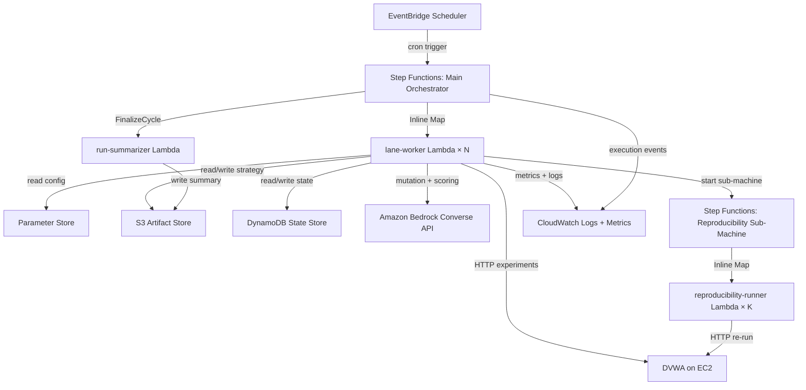

# Design Document: Lambda RedTeam Harness

## Overview

The AutoRedTeam Lambda Harness is a serverless, event-driven system that automates adversarial red-teaming experiments against a target web application (DVWA on EC2). The system is designed around a keep/discard ratchet: each cycle proposes a new attack mutation via Amazon Bedrock, executes it against DVWA, scores the result with a Phi function, and promotes the mutation only when it passes all quality gates and improves the score.

### Core Flow

```
EventBridge Scheduler
  → Step Functions (Main Orchestrator)
      → Inline Map (one Worker Lambda per Objective Lane, concurrent)
          → orchestrator-init: load lanes from Parameter Store
          → lane-worker (per lane):
              1. Load config from Parameter Store
              2. Fetch current Strategy from S3
              3. Set DVWA security level via /security.php
              4. Call Bedrock (mutation planning)
              5. Execute HTTP experiment against DVWA
              6. Check Terminal Validator
              7. Call Bedrock (scoring) → derive P_goal, C_pre, D_depth → Phi
              8. If Phi improves: trigger Reproducibility sub-machine
              9. Evaluate all 4 Gates
              10. Ratchet: promote or discard
          → run-summarizer: aggregate per-lane results → S3
```

### Design Goals

- **Reproducibility**: Every mutation, experiment, and scoring call is logged to S3 for full audit replay.
- **Monotonic improvement**: The ratchet ensures each lane's strategy only advances when all gates pass and Phi improves.
- **Isolation**: Each lane runs independently; a failure in one lane does not affect others.
- **Configurability**: All thresholds, weights, model IDs, and lane definitions live in Parameter Store — no code changes needed to tune the system.

---

## Architecture

### Component Diagram



### AWS Services

| Service | Role |
|---|---|
| EventBridge Scheduler | Cron-based trigger for the main orchestrator |
| Step Functions (Standard) | Main orchestrator — manages lane fan-out and finalization |
| Step Functions (Express) | Reproducibility sub-machine — parallel re-run fan-out |
| Lambda | orchestrator-init, lane-worker, reproducibility-runner, run-summarizer |
| Amazon Bedrock (Converse API) | Mutation planning + Phi sub-score derivation |
| S3 | Strategy files, experiment artifacts, Bedrock logs, run summaries |
| DynamoDB | Per-lane operational state, run metadata, ratchet history |
| Parameter Store (SSM) | All tunable config: schedule, lane defs, weights, thresholds |
| CloudWatch Logs + Metrics | Structured logs, custom metrics (PhiScore, GateFailures, TimeoutWarning) |
| VPC / Security Groups | Network isolation: Lambda → EC2 (port 80 only) |
| EC2 (t3.medium) | DVWA target running in Docker |

---

## Components and Interfaces

### Lambda Functions

#### 1. `orchestrator-init`

Invoked as the first step in the Main Orchestrator state machine.

**Inputs:** `{ run_id: str, timestamp: str }`

**Outputs:** `{ run_id: str, timestamp: str, lanes: [{ lane_id: str, config_prefix: str }] }`

**Responsibilities:**
- Load the list of active lane identifiers from Parameter Store at `/autoredteam/{env}/active_lanes`
- Validate that at least one lane is active
- Return the lane list to Step Functions for the Inline Map input

---

#### 2. `lane-worker`

The main per-lane Lambda. Executes one full experiment cycle.

**Inputs:** `{ run_id: str, lane_id: str, config_prefix: str }`

**Outputs:** `{ lane_id: str, status: "SUCCESS"|"TERMINAL_SUCCESS"|"FAILED"|"DISCARDED", phi_score: float, terminal: bool, error?: str }`

**Lifecycle (in order):**

1. **Config load** — `config_loader.py` reads all required keys from Parameter Store; terminates with structured error if any key is missing.
2. **Strategy fetch** — `strategy_store.py` reads `strategies/{lane_id}/current.json` from S3; initializes seed strategy if absent.
3. **DVWA security level** — `dvwa_client.py` POSTs to `/security.php` with the lane-specific level, then GETs to verify.
4. **Mutation planning** — `bedrock_client.py` sends a structured prompt (lane def + current strategy + last result) to Bedrock Converse API; parses response into a `Mutation` object.
5. **Experiment execution** — `dvwa_client.py` sends the HTTP request defined by the Mutation; captures full response.
6. **Terminal check** — `terminal_validator.py` evaluates the response against the lane's terminal condition.
7. **Phi scoring** — `bedrock_client.py` sends a separate scoring prompt; parses P_goal, C_pre, D_depth; `phi_function.py` computes Φ_i.
8. **Gate evaluation** — if Phi improves, triggers Reproducibility sub-machine, then evaluates Evidence, Cost, and Noise gates.
9. **Ratchet decision** — promotes or discards based on gate results.
10. **Observability** — emits structured logs and CloudWatch metrics throughout.

---

#### 3. `reproducibility-runner`

Invoked by the Reproducibility Sub-Machine's Inline Map. Re-runs a single mutation and returns pass/fail.

**Inputs:** `{ run_id: str, lane_id: str, mutation: Mutation, rerun_index: int }`

**Outputs:** `{ rerun_index: int, passed: bool, phi_score: float, terminal: bool }`

**Responsibilities:**
- Execute the mutation HTTP request against DVWA
- Run Terminal Validator and Phi scoring
- Return whether this re-run passes (terminal OR Phi improvement observed)

---

#### 4. `run-summarizer`

Invoked in the `FinalizeCycle` step of the Main Orchestrator.

**Inputs:** `{ run_id: str, timestamp: str, lane_results: [LaneResult] }`

**Outputs:** `{ summary_key: str }`

**Responsibilities:**
- Aggregate per-lane outcomes, Phi scores, terminal statuses, and gate failure counts
- Write `runs/{run_id}/summary.json` to S3
- Emit a final structured log entry

---

### Library Modules (`src/lib/`)

#### `bedrock_client.py`

```python
class BedrockClient:
    def propose_mutation(self, lane_def, strategy, last_result) -> MutationResponse
    def score_experiment(self, experiment_result, lane_rubric, strategy) -> PhiScores
```

- Uses `boto3` Bedrock Runtime `converse` API
- Model ID read from Parameter Store
- Retries up to `max_retries` (from config) on malformed responses
- Logs full prompt + response to S3 under `logs/{run_id}/{lane_id}/bedrock_{call_type}_{timestamp}.json`

#### `dvwa_client.py`

```python
class DVWAClient:
    def set_security_level(self, level: str) -> None
    def verify_security_level(self) -> str
    def execute_request(self, mutation: Mutation) -> ExperimentResult
```

- Manages a `requests.Session` with DVWA login cookie
- Enforces configurable HTTP timeout
- Raises `DVWAUnreachableError` on connection failure

#### `strategy_store.py`

```python
class StrategyStore:
    def get_current(self, lane_id: str) -> Strategy | None
    def promote(self, lane_id: str, strategy: Strategy) -> None
    def archive(self, lane_id: str, strategy: Strategy) -> None
```

- S3 key scheme: `strategies/{lane_id}/current.json` and `strategies/{lane_id}/history/{timestamp}.json`

#### `state_store.py`

```python
class StateStore:
    def get_lane_state(self, lane_id: str) -> LaneState
    def update_lane_state(self, lane_id: str, update: LaneStateUpdate) -> None  # conditional write
    def increment_discard_counter(self, lane_id: str) -> None
```

- All writes use DynamoDB conditional expressions to prevent concurrent run conflicts

#### `config_loader.py`

```python
class ConfigLoader:
    def load_lane_config(self, lane_id: str) -> LaneConfig
    def load_global_config(self) -> GlobalConfig
```

- Reads all parameters at startup; caches for Lambda invocation lifetime
- Raises `MissingConfigError` with the missing key path if any required key is absent

#### `evaluators/terminal_validator.py`

```python
class TerminalValidator:
    def evaluate(self, result: ExperimentResult, lane_def: LaneDefinition) -> TerminalResult
```

Per-lane logic:
- **OBJ_WEB_BYPASS**: `status == 200 AND success_indicator in body`
- **OBJ_IDENTITY_ESCALATION**: `privilege_string in body AND session_cookie is non_admin`
- **OBJ_WAF_BYPASS**: `waf_block_indicator NOT in body AND (sql_error OR xss_marker OR cmd_output) in body`

#### `evaluators/phi_function.py`

```python
class PhiFunction:
    def compute(self, scores: PhiScores, weights: PhiWeights) -> float
```

- `Φ_i = α_i × P_goal + β_i × C_pre + γ_i × D_depth`
- Clamps output to `[0.0, 1.0]`

#### `evaluators/gates.py`

```python
class GateEvaluator:
    def evaluate_evidence(self, result: ExperimentResult, lane_def: LaneDefinition) -> GateResult
    def evaluate_cost(self, token_usage: int, duration_ms: int, thresholds: CostThresholds) -> GateResult
    def evaluate_noise(self, result: ExperimentResult, noise_patterns: list[str]) -> GateResult
```

The Reproducibility Gate is handled by the nested Step Functions sub-machine, not inline in Lambda.

---

### Step Functions State Machines

#### Main Orchestrator (`infra/main_orchestrator.json`)

```
LoadObjectives (Lambda: orchestrator-init)
  → RunLanes (Map state, Inline, MaxConcurrency from config)
      → [lane-worker Lambda per lane]
  → FinalizeCycle (Lambda: run-summarizer)
```

- Error handling: `Map` state uses `Catch` to mark individual lane failures without stopping the map
- Standard workflow (supports long-running lanes up to 1 year)

#### Reproducibility Sub-Machine (`infra/reproducibility_sfn.json`)

```
RunReruns (Map state, Inline, MaxConcurrency = N reruns)
  → [reproducibility-runner Lambda per rerun]
  → AggregateResults (Pass state or Lambda)
  → PassOrFail (Choice state: fraction_passed >= min_fraction → Pass, else Fail)
```

- Express workflow (fast, cost-efficient for short re-runs)
- Invoked synchronously from `lane-worker` via `StartSyncExecution`

---

## Data Models

### Strategy (`strategies/{lane_id}/current.json`)

```json
{
  "lane_id": "OBJ_WEB_BYPASS",
  "version": 1,
  "phi_score": 0.42,
  "created_at": "2024-01-15T10:30:00Z",
  "promoted_at": "2024-01-15T10:30:00Z",
  "run_id": "run-20240115-001",
  "mutation": {
    "attack_payload": "...",
    "target_endpoint": "/dvwa/vulnerabilities/sqli/",
    "http_method": "POST",
    "headers": { "Content-Type": "application/x-www-form-urlencoded" },
    "rationale": "Bypass login via UNION-based injection"
  },
  "experiment_evidence": {
    "request": { "method": "POST", "url": "...", "body": "..." },
    "response": { "status_code": 200, "headers": {}, "body": "..." }
  }
}
```

### Mutation Object

```json
{
  "attack_payload": "string",
  "target_endpoint": "string",
  "http_method": "GET|POST|PUT|DELETE",
  "headers": { "key": "value" },
  "rationale": "string"
}
```

### Experiment Result

```json
{
  "run_id": "string",
  "lane_id": "string",
  "timestamp": "ISO8601",
  "request": {
    "method": "string",
    "url": "string",
    "headers": {},
    "body": "string"
  },
  "response": {
    "status_code": 200,
    "headers": {},
    "body": "string",
    "elapsed_ms": 120
  },
  "error": null
}
```

### DynamoDB: `ObjectiveLanes` Table

| Attribute | Type | Description |
|---|---|---|
| `lane_id` (PK) | String | e.g., `OBJ_WEB_BYPASS` |
| `phi_score` | Number | Current best Phi score |
| `terminal_status` | String | `ACTIVE`, `TERMINAL_SUCCESS` |
| `discard_count` | Number | Cumulative discards |
| `last_run_id` | String | Most recent run identifier |
| `last_updated` | String | ISO8601 timestamp |
| `last_gate_failure` | String | Name of last failing gate (nullable) |

### DynamoDB: `Runs` Table

| Attribute | Type | Description |
|---|---|---|
| `run_id` (PK) | String | e.g., `run-20240115-001` |
| `timestamp` | String | ISO8601 start time |
| `status` | String | `RUNNING`, `COMPLETE`, `PARTIAL_FAILURE` |
| `lane_count` | Number | Number of lanes in this run |
| `completed_lanes` | Number | Lanes that finished (success or terminal) |
| `failed_lanes` | Number | Lanes that errored |

### Parameter Store Key Hierarchy

```
/autoredteam/{env}/
  schedule_expression          # cron(0 */6 * * ? *)
  active_lanes                 # ["OBJ_WEB_BYPASS","OBJ_IDENTITY_ESCALATION","OBJ_WAF_BYPASS"]
  bedrock_model_id             # amazon.nova-pro-v1:0
  map_max_concurrency          # 10
  lanes/
    {lane_id}/
      target_url               # http://10.0.1.50/dvwa
      dvwa_security_level      # low | medium | high | impossible
      terminal_condition       # { type, success_indicator, ... }
      phi_weights/
        alpha                  # 0.4
        beta                   # 0.35
        gamma                  # 0.25
      gate_thresholds/
        reproducibility_min_fraction   # 0.8
        reproducibility_reruns         # 5
        evidence_markers               # ["SQL syntax", "mysql_fetch"]
        cost_max_tokens                # 50000
        cost_max_duration_ms           # 240000
        noise_patterns                 # ["DVWA default page", "Login required"]
      bedrock_max_retries      # 3
      http_timeout_ms          # 10000
  dvwa/
    admin_username             # admin
    admin_password             # password (SecureString)
```

---

## Correctness Properties

*A property is a characteristic or behavior that should hold true across all valid executions of a system — essentially, a formal statement about what the system should do. Properties serve as the bridge between human-readable specifications and machine-verifiable correctness guarantees.*


### Property 1: Execution payload completeness

*For any* invocation timestamp, the execution payload produced by `orchestrator-init` SHALL contain a non-empty `run_id` string and a valid ISO8601 `timestamp` field.

**Validates: Requirements 1.2**

---

### Property 2: Lane list round-trip

*For any* list of active lane identifiers stored in Parameter Store, `orchestrator-init` SHALL return exactly that list in its output payload — no lanes added, none dropped.

**Validates: Requirements 1.4**

---

### Property 3: Lane failure isolation

*For any* subset of lanes that raise an unhandled error during the Inline Map execution, the remaining lanes SHALL complete successfully and the overall Step Functions execution SHALL NOT be aborted.

**Validates: Requirements 2.2**

---

### Property 4: Run summary completeness

*For any* list of per-lane results passed to `run-summarizer`, the JSON written to `runs/{run_id}/summary.json` SHALL contain an entry for every lane, each with `outcome`, `phi_score`, and `terminal_status` fields.

**Validates: Requirements 2.3, 10.5**

---

### Property 5: Config completeness validation

*For any* lane identifier, when `config_loader` is given a Parameter Store namespace that is missing one or more required keys, it SHALL raise `MissingConfigError` identifying every missing key path. When all required keys are present, it SHALL return a `LaneConfig` with all fields populated.

**Validates: Requirements 3.1, 3.4, 11.3**

---

### Property 6: Worker error payload on config failure

*For any* lane identifier, when `config_loader` raises an exception (unreachable or missing keys), the worker error payload SHALL contain that `lane_id` and a non-empty `failure_reason` string.

**Validates: Requirements 3.3**

---

### Property 7: Mutation planning prompt completeness

*For any* combination of `lane_def`, `strategy`, and `last_result`, the prompt constructed for the Bedrock mutation planning call SHALL contain serialized representations of all three inputs.

**Validates: Requirements 4.1**

---

### Property 8: Mutation object structural completeness

*For any* valid Bedrock mutation planning response, parsing SHALL produce a `Mutation` object with all five required fields present and non-empty: `attack_payload`, `target_endpoint`, `http_method`, `headers`, and `rationale`.

**Validates: Requirements 4.3**

---

### Property 9: Bedrock retry count enforcement

*For any* configured `max_retries` value N (≥ 1), when the Bedrock client receives only malformed responses, it SHALL make exactly N + 1 total API calls before raising an error.

**Validates: Requirements 4.4**

---

### Property 10: Bedrock audit log completeness

*For any* Bedrock API call (mutation planning or scoring), the S3 artifact written SHALL contain both the full prompt sent and the full response body received.

**Validates: Requirements 4.5**

---

### Property 11: HTTP request fidelity

*For any* `Mutation` object, the HTTP request sent by `dvwa_client.execute_request` SHALL match the mutation's `http_method`, `target_endpoint`, `headers`, and `attack_payload` exactly.

**Validates: Requirements 5.1**

---

### Property 12: Experiment result capture completeness

*For any* HTTP response received from DVWA, the resulting `ExperimentResult` SHALL contain `status_code` (integer), `headers` (dict), and `body` (string).

**Validates: Requirements 5.2**

---

### Property 13: HTTP timeout enforcement

*For any* configured timeout value T (ms), when the DVWA response takes longer than T ms, the experiment result SHALL be marked as failed and no successful result SHALL be returned.

**Validates: Requirements 5.4**

---

### Property 14: Artifact key scoping

*For any* `run_id`, `lane_id`, and artifact type (experiment result, strategy, Bedrock log), the S3 key used to store the artifact SHALL contain both `run_id` and `lane_id` as path components, and strategy keys SHALL follow the pattern `strategies/{lane_id}/current.json` (active) and `strategies/{lane_id}/history/{timestamp}.json` (archived).

**Validates: Requirements 5.5, 9.5, 10.2**

---

### Property 15: Terminal validator returns boolean

*For any* `ExperimentResult` and `LaneDefinition`, `terminal_validator.evaluate` SHALL return a boolean value (`True` or `False`) — never `None`, never an exception for valid inputs.

**Validates: Requirements 6.2**

---

### Property 16: Terminal success fast-path skips gates

*For any* experiment result where `terminal_validator` returns `True`, the worker SHALL write `TERMINAL_SUCCESS` to DynamoDB for the lane AND SHALL NOT invoke any gate evaluator functions.

**Validates: Requirements 6.3**

---

### Property 17: Terminal success evidence persistence

*For any* terminal success event, the S3 artifact written SHALL contain both the `ExperimentResult` and the `Mutation` that triggered the terminal condition, including the matched indicator string.

**Validates: Requirements 6.4, 14.3**

---

### Property 18: Scoring call conditionality

*For any* experiment result where `terminal_validator` returns `False`, `bedrock_client.score_experiment` SHALL be called exactly once. For any result where `terminal_validator` returns `True`, `score_experiment` SHALL NOT be called.

**Validates: Requirements 7.1**

---

### Property 19: Phi computation correctness and range

*For any* weights (α, β, γ) and sub-scores (P_goal, C_pre, D_depth) all in [0.0, 1.0], `phi_function.compute` SHALL return exactly `α × P_goal + β × C_pre + γ × D_depth` clamped to [0.0, 1.0], and the result SHALL always be within [0.0, 1.0].

**Validates: Requirements 7.3, 7.4**

---

### Property 20: Ratchet discard on non-improving Phi

*For any* new Phi score ≤ current strategy Phi score, the worker SHALL NOT write to S3 for strategy promotion, SHALL NOT update the DynamoDB strategy fields, and SHALL increment the `discard_count` by exactly 1.

**Validates: Requirements 7.6, 9.4**

---

### Property 21: Reproducibility gate threshold

*For any* list of re-run results and any configured `min_fraction` threshold, the reproducibility gate SHALL pass if and only if `(count of passing re-runs / total re-runs) >= min_fraction`.

**Validates: Requirements 8.2**

---

### Property 22: Evidence gate marker containment

*For any* `ExperimentResult` and any configured set of required evidence markers, the evidence gate SHALL pass if and only if every marker string appears in the response body.

**Validates: Requirements 8.3**

---

### Property 23: Cost gate threshold enforcement

*For any* `token_usage`, `duration_ms`, `max_tokens`, and `max_duration_ms`, the cost gate SHALL pass if and only if `token_usage <= max_tokens AND duration_ms <= max_duration_ms`.

**Validates: Requirements 8.4**

---

### Property 24: Noise gate pattern exclusion

*For any* response body and any list of configured noise patterns, the noise gate SHALL pass if and only if no noise pattern string appears in the response body.

**Validates: Requirements 8.5**

---

### Property 25: Gate failure records gate name

*For any* gate that returns a failure result, the worker SHALL write the failing gate's name and reason to DynamoDB for the lane AND SHALL NOT promote the strategy to S3.

**Validates: Requirements 8.6**

---

### Property 26: Strategy promotion on all-gates-pass

*For any* mutation where all four gates pass and `new_phi > current_phi`, the worker SHALL write the new strategy to S3 at `strategies/{lane_id}/current.json` containing the mutation, new Phi score, and experiment evidence.

**Validates: Requirements 9.1**

---

### Property 27: State store update on promotion

*For any* strategy promotion event, the DynamoDB record for the lane SHALL be updated with the new `phi_score`, a valid ISO8601 `promotion_timestamp`, and the current `run_id`.

**Validates: Requirements 9.2**

---

### Property 28: Strategy history preservation

*For any* sequence of N strategy promotions for a lane, there SHALL be exactly N entries under `strategies/{lane_id}/history/` in S3, each preserving the full prior strategy.

**Validates: Requirements 9.3**

---

### Property 29: Lane state record completeness

*For any* lane state write operation, the DynamoDB record SHALL contain all five required fields: `phi_score` (number), `terminal_status` (string), `discard_count` (number), `last_run_id` (string), and `last_updated` (ISO8601 string).

**Validates: Requirements 10.1**

---

### Property 30: DynamoDB conditional write usage

*For any* `state_store.update_lane_state` call, the underlying DynamoDB `update_item` API call SHALL include a `ConditionExpression` parameter.

**Validates: Requirements 10.3**

---

### Property 31: Config caching — single SSM read per invocation

*For any* Lambda invocation, `config_loader` SHALL call SSM `GetParameter(s)` only during the initialization phase; subsequent calls to retrieve config values within the same invocation SHALL use the cached values without additional SSM API calls.

**Validates: Requirements 11.2**

---

### Property 32: Parameter Store path prefix

*For any* parameter read by `config_loader`, the SSM path used SHALL start with the configured root prefix (e.g., `/autoredteam/{env}/`).

**Validates: Requirements 11.4**

---

### Property 33: DVWA security level set-and-verify round-trip

*For any* configured `dvwa_security_level` for a lane, after `dvwa_client.set_security_level` completes, `dvwa_client.verify_security_level` SHALL return the same level that was set.

**Validates: Requirements 12.6, 12.8**

---

### Property 34: OBJ_WEB_BYPASS terminal condition

*For any* HTTP response, the `OBJ_WEB_BYPASS` terminal validator SHALL return `True` if and only if `status_code == 200` AND the configured `success_indicator` string is present in the response body. Responses with 3xx, 4xx, or 5xx status codes SHALL always return `False` regardless of body content.

**Validates: Requirements 14.1, 14.2**

---

### Property 35: OBJ_IDENTITY_ESCALATION terminal condition

*For any* HTTP response and session context, the `OBJ_IDENTITY_ESCALATION` terminal validator SHALL return `True` if and only if the configured `privilege_string` is present in the response body AND the session cookie belongs to a non-admin account. Requests made with an admin session SHALL always return `False`.

**Validates: Requirements 14.4, 14.5**

---

### Property 36: OBJ_WAF_BYPASS terminal condition

*For any* HTTP response, the `OBJ_WAF_BYPASS` terminal validator SHALL return `True` if and only if the configured `waf_block_indicator` is NOT present in the response body AND at least one interpretation marker (SQL error string, XSS execution marker, or command output string) IS present. Responses containing the WAF block indicator SHALL always return `False` even if the status code is 200.

**Validates: Requirements 14.6, 14.7**

---

### Property 37: Structured log format

*For any* worker lifecycle event (initialization, strategy fetch, mutation proposal, experiment execution, gate evaluation, ratchet decision), the log entry emitted to CloudWatch SHALL be valid JSON containing at minimum `event_type`, `lane_id`, and `timestamp` fields.

**Validates: Requirements 13.1**

---

### Property 38: CloudWatch metric emission on ratchet and gate events

*For any* ratchet decision (promote or discard), the worker SHALL call CloudWatch `PutMetricData` with metric name `RedTeam/PhiScore` tagged with `lane_id` and `run_id`. *For any* gate failure, the worker SHALL call `PutMetricData` with metric name `RedTeam/GateFailures` tagged with `gate_name` and `lane_id`.

**Validates: Requirements 13.3, 13.4**

---

### Property 39: Timeout warning metric emission

*For any* Lambda invocation where `elapsed_ms > 0.8 × configured_timeout_ms`, the worker SHALL emit a `RedTeam/TimeoutWarning` CloudWatch metric before the invocation completes.

**Validates: Requirements 13.5**

---

## Error Handling

### Failure Modes and Responses

| Failure | Handler | Outcome |
|---|---|---|
| Config_Store unreachable | `config_loader` | Raise `ConfigLoadError`; worker returns structured error payload with `lane_id` and reason |
| Missing required config key | `config_loader` | Raise `MissingConfigError(key_path)`; worker terminates with descriptive error |
| DVWA unreachable | `dvwa_client` | Raise `DVWAUnreachableError`; write failure to DynamoDB; lane returns `FAILED` |
| DVWA HTTP timeout | `dvwa_client` | Raise `DVWATimeoutError`; experiment result marked as failed |
| DVWA security level mismatch | `dvwa_client` | Raise `SecurityLevelVerificationError`; lane terminates before experiment |
| Bedrock malformed response | `bedrock_client` | Retry up to `max_retries`; after exhaustion raise `BedrockParseError` |
| Bedrock API error (throttle/5xx) | `bedrock_client` | Exponential backoff retry; after exhaustion raise `BedrockAPIError` |
| S3 write failure | `strategy_store` | Raise `ArtifactStoreError`; lane returns `FAILED` |
| DynamoDB conditional write conflict | `state_store` | Raise `StateConflictError`; lane logs conflict and returns `FAILED` |
| Reproducibility sub-machine failure | `lane-worker` | Treat as gate failure; record in DynamoDB; discard mutation |
| Step Functions lane failure | Main Orchestrator | `Catch` on Map state; mark lane as `FAILED`; continue remaining lanes |

### Error Payload Schema

All Lambda error payloads follow this structure:

```json
{
  "lane_id": "OBJ_WEB_BYPASS",
  "run_id": "run-20240115-001",
  "error_type": "MissingConfigError",
  "error_message": "Required parameter not found: /autoredteam/prod/lanes/OBJ_WEB_BYPASS/phi_weights/alpha",
  "timestamp": "2024-01-15T10:30:00Z",
  "stage": "initialization"
}
```

### Retry Strategy

- **Bedrock mutation/scoring calls**: Up to `bedrock_max_retries` retries on parse failure; exponential backoff on API errors (base 1s, max 30s)
- **DynamoDB writes**: Single attempt with conditional expression; no automatic retry (caller handles `ConditionalCheckFailedException`)
- **S3 writes**: AWS SDK default retry (3 attempts with exponential backoff)
- **DVWA HTTP requests**: No retry — a failed experiment is recorded as-is; the next cycle will propose a new mutation

---

## Testing Strategy

### Dual Testing Approach

The harness uses both unit/example-based tests and property-based tests:

- **Unit tests**: Specific examples, integration points, error conditions, infrastructure smoke checks
- **Property tests**: Universal properties across all valid inputs (the 39 properties defined above)

### Property-Based Testing

**Library**: [`hypothesis`](https://hypothesis.readthedocs.io/) (Python)

Each property test is configured with a minimum of **100 iterations** (`@settings(max_examples=100)`).

Each test is tagged with a comment referencing the design property:

```python
# Feature: lambda-redteam-harness, Property 19: Phi computation correctness and range
@settings(max_examples=100)
@given(
    alpha=st.floats(0.0, 1.0),
    beta=st.floats(0.0, 1.0),
    gamma=st.floats(0.0, 1.0),
    p_goal=st.floats(0.0, 1.0),
    c_pre=st.floats(0.0, 1.0),
    d_depth=st.floats(0.0, 1.0),
)
def test_phi_computation_correctness_and_range(alpha, beta, gamma, p_goal, c_pre, d_depth):
    weights = PhiWeights(alpha=alpha, beta=beta, gamma=gamma)
    scores = PhiScores(p_goal=p_goal, c_pre=c_pre, d_depth=d_depth)
    result = PhiFunction().compute(scores, weights)
    expected = alpha * p_goal + beta * c_pre + gamma * d_depth
    assert 0.0 <= result <= 1.0
    assert abs(result - min(max(expected, 0.0), 1.0)) < 1e-9
```

### Test Categories

**Smoke Tests** (infrastructure validation, run once):
- EventBridge Scheduler rule exists and targets correct Step Functions ARN
- Step Functions ASL contains Map state with correct structure
- Step Functions has X-Ray tracing enabled
- S3 bucket has versioning enabled
- All required Parameter Store paths exist

**Unit / Example Tests**:
- Strategy fetch: existing strategy returned unchanged
- Strategy fetch: absent strategy returns valid seed with `phi_score=0.0`
- DVWA unreachable: DynamoDB failure record written, lane returns `FAILED`
- Bedrock model ID: API call uses model ID from config (mocked Bedrock)

**Property Tests** (Hypothesis, 100+ iterations each):
- All 39 properties defined in the Correctness Properties section above
- Bedrock and DVWA calls are mocked for all property tests
- DynamoDB and S3 calls use moto (AWS mock library) or in-memory fakes

**Integration Tests** (against real AWS, run in CI/CD):
- End-to-end: trigger orchestrator → verify lane completes → verify S3 artifacts exist
- Concurrent execution: two Step Functions executions run simultaneously without interference
- DVWA security level: set level via API → verify level persists across requests

### Test File Structure

```
tests/
  unit/
    test_phi_function.py          # Properties 19
    test_terminal_validators.py   # Properties 15, 34, 35, 36
    test_gates.py                 # Properties 21, 22, 23, 24
    test_config_loader.py         # Properties 5, 6, 31, 32
    test_bedrock_client.py        # Properties 7, 8, 9, 10, 18
    test_dvwa_client.py           # Properties 11, 12, 13, 33
    test_strategy_store.py        # Properties 14, 26, 28
    test_state_store.py           # Properties 20, 25, 27, 29, 30
    test_run_summarizer.py        # Properties 4
    test_orchestrator_init.py     # Properties 1, 2
    test_lane_worker.py           # Properties 3, 16, 17, 37, 38, 39
  integration/
    test_end_to_end.py
    test_concurrent_execution.py
  smoke/
    test_infrastructure.py
```
